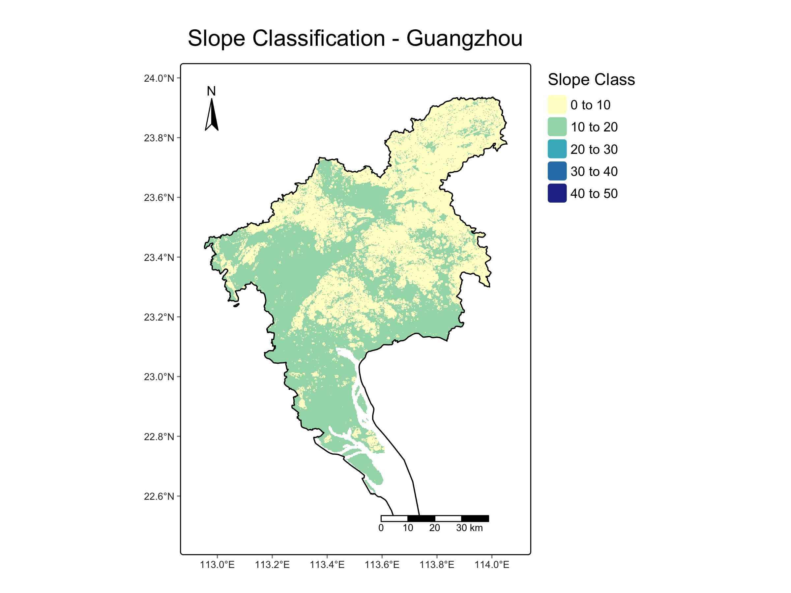

# 📍 广州坡度等级分析项目

本仓库是一个基于 R 语言的广州坡度分类与地图制图项目，主要使用了 `terra`、`sf` 和 `tmap` 等空间分析与可视化包。

---

## 📚 学习背景：第 2 课 - 坡度地图制图

本项目是作者根据学习课程自建 R 地理空间学习课程的第 2 课，主题是：
- 利用 DEM 生成坡度图
- 对坡度进行分级
- 输出高质量地图

---

## 📂 项目目录结构

```
guangzhou-slope-analysis/
├── data/         # 数据文件（shapefile 和 DEM，未上传）
├── output/       # 输出地图和栅格文件
├── scripts/      # 主脚本文件
├── .gitignore    # 忽略 data/output 等目录
└── README.md     # 本项目说明文档
```

---

## 🛠️ 使用方法

1. 克隆本仓库或下载 ZIP
2. 将你的 shapefile 和 DEM 放入 `data/` 文件夹
3. 用 RStudio 或 VS Code 打开 `scripts/02_slope_map_guangzhou.R`
4. 按行运行脚本，可完成：
   - DEM 裁剪为广州区域
   - 坡度计算
   - 坡度等级划分与地图输出
5. 所有输出将保存在 `output/` 文件夹

---

## 📦 所需 R 包

请先安装以下依赖包：

```r
install.packages(c("terra", "sf", "tmap", "tidyverse"))
```

---

## 🗺️ 输出示例

最终输出地图如下所示：



---

## 📄 许可协议

本项目基于 MIT 协议开源。欢迎用于教学、学习与非商业目的。